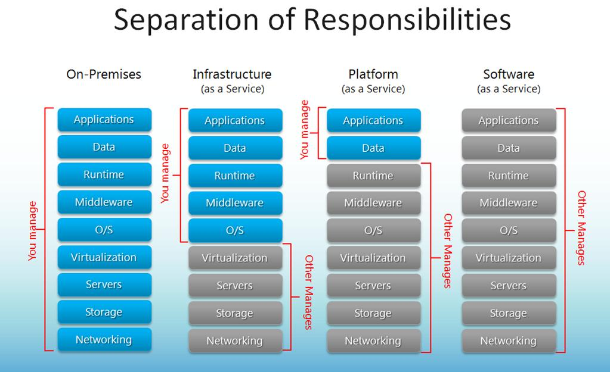

# Enablers for Cloud Computing

---

## History of Cloud Computing

* 1990s – Grid Computing Foundations
  Grid computing emerged to connect geographically distributed, heterogeneous computing resources for large-scale scientific and engineering problems, emphasizing resource sharing and distributed problem-solving.

* Early 2000s – Limitations of Grid Computing
  While grids excelled at batch processing and research workloads, they struggled with scalability for dynamic, commercial applications due to complex provisioning, heterogeneous systems, and lack of standardized interfaces.

---

## History Cont.

* Mid-2000s – Cloud Concept Evolves from Grid Principles
  Cloud computing borrowed the distributed resource pooling of grid computing but added virtualization, automation, and service abstraction, enabling elastic scaling and simplified access through web-based APIs.

* 2006 Onward – Commercial Cloud Emergence
  Amazon Web Services (AWS) popularized the pay-as-you-go Infrastructure-as-a-Service model with Amazon EC2 and S3, building on lessons from grid scheduling, virtualization, and resource orchestration.

* 2010s – Cloud Becomes the Dominant Paradigm
  Cloud computing expanded beyond infrastructure to include Platform-as-a-Service and Software-as-a-Service, leveraging the scalability concepts pioneered by grid computing but optimized for enterprise, consumer, and IoT workloads.

---

## History of Cloud Products

Here’s the same content from the diagram in bullet points:

### Early Utility & Grid Offerings

* Sun Grid
* HP Utility Data Center
* IBM On Demand Computing
* DEISA
* SETI@home

--- 

### Pre-AWS Hosting Services

* Loudcloud
* Rackspace Managed Hosting
* Enki
* Intel Cloud

---

### Cloud Providers (pre- and early AWS era) - Pay per CPU cycle.

* Sun Grid
* Google
* Microsoft

### Leading to 2006

* AWS

---

## Accidental Birth of AWS

Dr. Werner Vogels part of the Open Grid Forum hired by Amazon to help develop a Grid Computing architecture to handle
bursting workloads during Christmas rush.

###  Pre-2004 – Academic & OGF Work

Werner Vogels was a researcher at Cornell University working on large-scale distributed systems and reliability.

Participated in discussions at the Global Grid Forum (GGF) — precursor to the Open Grid Forum (OGF) — which promoted interoperability standards for grid computing.

--- 

### 2004 – Joins Amazon

Hired as Director of Systems Research, bringing expertise in fault-tolerant, distributed infrastructure.

Applied lessons from grid computing standards and research to Amazon’s internal service-oriented architecture.

### 2005 – AWS Foundations

Worked on transforming Amazon’s internal infrastructure into external, customer-facing services.

Advocated APIs, self-service provisioning, and elasticity — principles influenced by grid computing but adapted for commercial scale.

--- 

### 2006 – AWS Launch

Amazon Simple Storage Service (S3) and Elastic Compute Cloud (EC2) debut.

Vogels’ architectural leadership ensures scalability, availability, and developer-centric access.

### Post-2006 – Cloud Evangelism

Became Amazon CTO and global evangelist for cloud computing.

Continues to promote concepts rooted in distributed/grid principles, adapted to meet enterprise and internet-scale demands.

---

## Why Did This Become Feasible

- The Business model made it profitable. $$$
- The Cloud Computing model made it feasible
- Ability to construct very large-scale, commodity-computer data centers due to
  cheap and faster hardware (X86 Machines disrupted proprietary platforms)
- Significant advances in networking technologies
- Ability to virtualize a variety of resource types
- Increase Utilization of hardware.

---

## Three Basic Service Models

Illustrates how the cloud is offered to the user as a service
1. Software-as-a-Service (SaaS): ready-made services/applications are hosted by the provider
   on the cloud and made available to users
    - For example, Google calendar, Google docs, Gmail, Dropbox, Salesforce, Netflix
    
---

2. Platform-as-a-Service (PaaS): refers essentially to the framework hosted on the cloud
   infrastructure that enables users to build cloud-hosted applications
    - Often comprises the LAMP stack (Linux, Apache HTTP server, MySQL DB, and PHP/Perl/Python)
    - For example, Google AppEngine, Microsoft Azure; probably MOOCs, Piazza, etc. lie here
   
---

3. Infrastructure-as-a-Service (IaaS): refers to the service that provides access to the
   infrastructure level resources
    - Users are responsible for hosting their platform and applications
    - For example, Amazon EC2

Other models also exist, e.g., Function-as-a-Service (which we will study as part of
serverless computing)

---

## Distinguishing the Service Models

Source: [http://www.thomasmaurer.ch/2013/06/the-definition-of-cloud-computing/](http://www.thomasmaurer.ch/2013/06/the-definition-of-cloud-computing/)

---

## Stacking of Different Service Models

Source: [http://librairie.immateriel.fr/](http://librairie.immateriel.fr/)

---

## Deployment Models

1. Private cloud: where the cloud infrastructure is provisioned for a single entity/organization
    - Managed by the organization or third party
    - Could be on premise or off premise
2. Community cloud: provisioned to meet the common requirements of a community
3. Public cloud: provisioned for use by the general public
4. Hybrid cloud: comprises a composition of two or more distinct cloud offerings from the
   above set with some capability for interoperability and application portability
    * Increasingly, companies are requiring part of their IT to execute in public cloud and part of their IT to execute on private resources
5. Multi-Hybrid Cloud: a combination of multiple public and private clouds

---