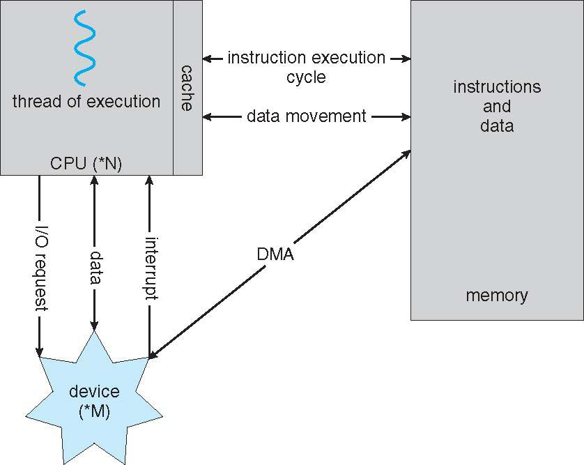
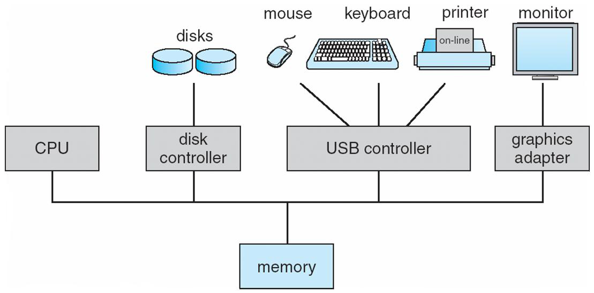

  # Operating Systems and Networks

---

## Sources

### Operating systems
- Silbershatz’s operating system (OS) book and modified/ reordered
- as needed and added some of my own slides/ figures

### Networking 
- Taken from slides available online for Kurose -Ross’
- textbook on Computer Networking: A Top -Down Approach ,
- sixth edition, and adapted to suite our discussion

---

## Overview of Operating Systems
- Overview of Operating Systems

---

## How a Modern Computer Works
- How a Modern Computer Works

---
## Traditional Computing Resources
- How to manage all these resources?
- How to share these with the applications that need them?

## What is an Operating System
- A program that acts as an intermediary between a user of a computer and the computer hardware
- Operating system goals
    - Execute user programs and make solving user problems easier
    - Make the computer system convenient to use
    - Use the computer hardware in an efficient manner
    - 

---
## Operating System Definition

- OS is a resource allocator.
    - Manages all resources
    - Decides between conflicting requests for efficient and fair resource use
- OS is a control program.
    - Controls execution of programs to prevent errors and improper  use of the computer

---
## Common Functions of Interrupts
- Interrupt transfers control to the interrupt service routine generally,
through the interrupt vector, which contains the addresses of all
the service routines.
- Interrupt architecture must save the address of the interrupted
instruction.
- Incoming interrupts are disabled while another interrupt is being
processed to prevent a lost interrupt.
- A trap is a software -generated interrupt caused either by an error
or a user request.
- An operating system is interrupt driven.

---
