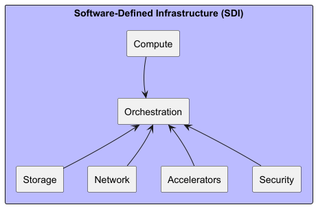

# What Is IaaS?

- On-demand virtualized compute, storage, network, and security  
- Self-service provisioning via APIs or console  
- Avoid capital expense; pay only for resources used  

---

## 1. Software-Defined Infrastructure

All resources are defined, provisioned, and managed in software.

---

### 1.1 Compute

- **Virtual Machines**  
  - vCPU/RAM combinations; instance families (general-purpose, CPU/memory-optimized)  
  - Public images (Linux/Windows), marketplace, custom snapshots  
- **Autoscaling Groups**  
  - Automatic scale-out/in based on metrics (CPU, queues, custom)  
- **Bare-Metal / Dedicated Hosts**  
  - Physical servers on demand for low-latency or licensing needs  

---

### 1.2 Storage

- **Block Storage**: persistent disks/volumes with tunable IOPS/throughput  
- **Object Storage**: S3-style buckets for durable blobs; HTTP(S) access  
- **File/NFS Storage**: managed, network-mounted file systems  
- **Ephemeral Instance Store**: local SSD/NVMe for cache; data lost on termination  

---

### 1.3 Networking

- **VPC / Virtual Network**: isolated layer-3 network with subnets & route tables  
- **Load Balancers**: L4 TCP/UDP & L7 HTTP(S) distribution  
- **VPN & Direct Connect**: secure tunnels between on-prem & cloud  
- **SDN Routing & NAT**: internet/NAT gateways, transit/peering  
- **Network Security**: security groups (VM-level), NACLs (subnet), WAFs  

---

### 1.4 Security & Identity

- **IAM**: roles & policies for API/console access  
- **KMS**: key creation, storage, rotation  
- **Secrets Manager**: credentials, certificates, tokens  
- **Security Monitoring**: audit logs, vulnerability scans, compliance dashboards  

---

### 1.5 Accelerators

- **GPU Instances**: NVIDIA/AMD/Intel VMs for AI/ML & HPC  
- **FPGA / ASIC Instances**: custom hardware for encryption, genomics  
- **Inference / TPU-style**: managed neural-network inference endpoints  
- **XPU / NPU Instances**: custom hardware for machine learning  

---

## 2. Common IaaS Interfaces

1. **Web Console / GUI**  
2. **CLI** (`aws`, `az`, `gcloud`)  
3. **RESTful APIs** (JSON over HTTP)  
4. **Language SDKs** (Java, Python, Go, JavaScript)  
5. **IaC Tools** (Terraform, CloudFormation, ARM/Bicep, Pulumi, Ansible)  
6. **Operators & Provisioners** (Kubernetes operators, Terraform providers)  

---

## 3. Key Takeaways

- IaaS abstracts hardware into software-defined services  
- Everything managed via API enables full automation  
- Interfaces range from point-and-click to code-first IaC  
- Design for scalability, security, and cost-efficiency  

---