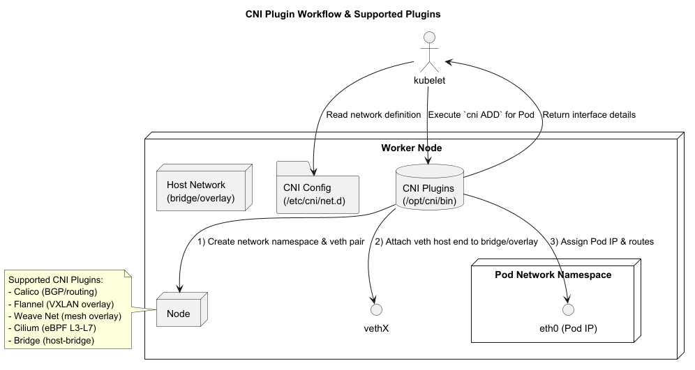
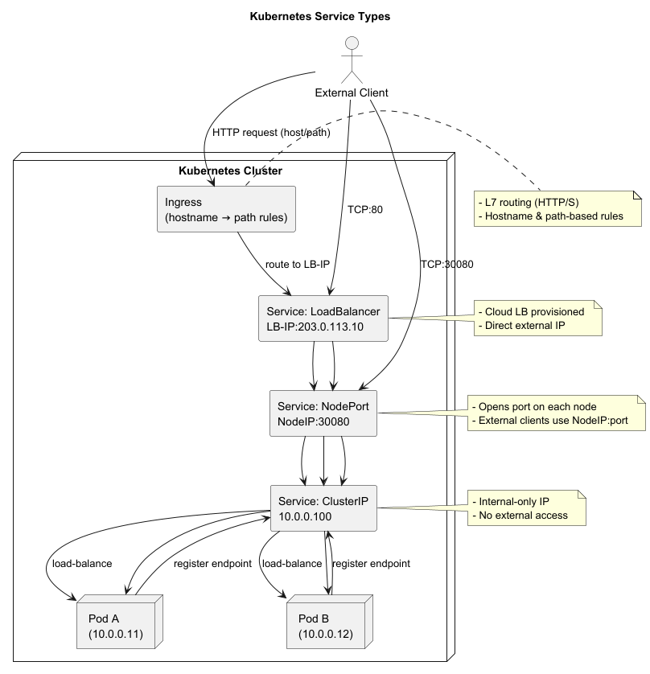

# Kubernetes Networking Primer

---

## Fundamental Model

1. **Flat Pod Network**
    - Every Pod receives a unique, routable IP address.
    - Pods communicate directly with no NAT (Container → Pod IP).

2. **Service Abstraction**
    - A Kubernetes Service defines a stable **ClusterIP** and DNS name.
    - Traffic to that IP routes to one of the matching Pods.

3. **NetworkPolicy**
    - Declarative rules controlling Pod-to-Pod traffic (namespaces, labels, ports).
    - Enforced by CNI plugin or eBPF layer (e.g., Calico, Cilium).

---

## Pod-to-Pod Connectivity



--- 

## Pod-to-Pod Connectivity

- **CNI Plugins** implement the network model:
    - **Calico**: BGP/routing
    - **Flannel**: VXLAN overlay
    - **Weave Net**: mesh overlay
    - **Cilium**: eBPF L3–L7 networking & security

- On each node:
    1. **CNI ADD**: create network namespace & veth pair
    2. Attach veth host end to bridge or overlay
    3. Assign Pod IP and routes

---

## Service Networking



--- 

## Service Networking
- **ClusterIP**
    - Virtual IP accessible only inside cluster.
    - kube-proxy programs iptables/IPVS rules to load-balance traffic.

- **NodePort**
    - Opens a static port on every node for external access.

- **LoadBalancer**
    - In cloud environments, provisions an external load balancer with a public IP.

- **Ingress**
    - L7 routing rules (HTTP/S) managed by Ingress controller (NGINX, Traefik).

---

## DNS & Discovery

- **CoreDNS / kube-dns**
    - Pods and Services resolve names via in-cluster DNS (e.g., `my-service.my-namespace.svc.cluster.local`).

- **Headless Services**
    - No ClusterIP; DNS returns Pod IPs directly for client-side load balancing.

---

## Network Policies

```yaml
apiVersion: networking.k8s.io/v1
kind: NetworkPolicy
metadata:
  name: allow-app-to-db
  namespace: prod
spec:
  podSelector:
    matchLabels: { role: db }
  ingress:
    - from:
        - podSelector: { role: app }
      ports:
        - protocol: TCP
          port: 5432
```


- Defines which Pods (by label) can talk to which Pods on which ports.
- When no policies exist, all Pod-to-Pod traffic is allowed by default.

---

## Multi-Cluster & Cross-Cloud

- **Service Mesh Federation** (Istio Multicluster)
- **Global DNS & Mesh** (Linkerd, Consul)
- **Network Fabric Extensions** (Submariner for direct pod networks)

---

## Best Practices

- Choose a CNI that matches your scale and security needs (e.g., Calico for policy, Flannel for simplicity).
- Always use NetworkPolicies to enforce least-privilege.
- Use headless Services for stateful sets and client-side balancing.
- Monitor network metrics (latency, throughput, dropped packets).
- Test MTU settings when using overlays (VXLAN adds 50 bytes).

---

# Summary

- Kubernetes networking provides a unified IP-per-Pod model
- Offers stable service endpoints
- Programmable security via NetworkPolicies
- Selecting the right CNI plugin and leveraging Services, Ingress, and policies enables:
    - Building resilient architectures
    - Creating secure microservices
    - Scaling effectively
