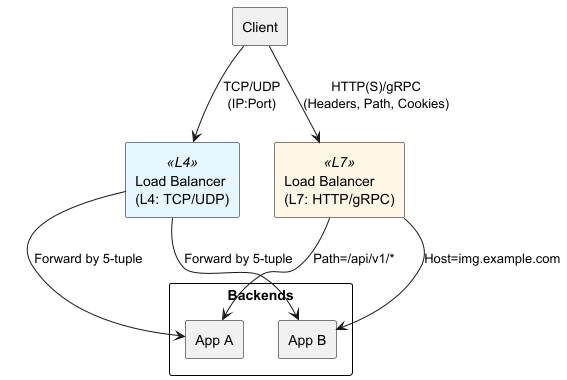
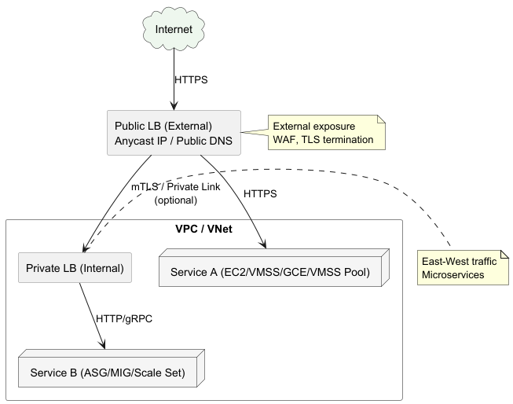
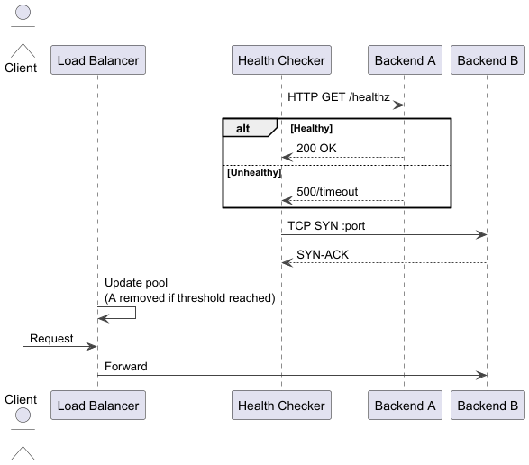

# Cloud Load Balancing

Load balancing distributes incoming traffic across multiple backend servers or services to improve availability, scalability, and performance. Cloud providers offer managed load-balancing services with varying features at Layer 4 (transport) and Layer 7 (application).

---

## Why Load Balance?

- **High Availability**  
  Detect and remove unhealthy instances; fail traffic over to healthy backends.

- **Scalability**  
  Spread load over many servers; autoscale backend pool in response to demand.

- **Performance & Latency**  
  Route clients to the nearest or least-loaded backend.

- **Security & Observability**  
  Centralized SSL/TLS termination, logging, and metrics collection.

---

## Load Balancer Types

### Layer 4 (Transport-Level)

- Operates on TCP/UDP: uses IP addresses and ports.
- Simple, high-performance forwarding.
- No visibility into HTTP paths or headers.
- Supports protocols: TCP, UDP, SSL (TLS pass-through).

Examples:
- AWS Network Load Balancer (NLB)
- Google Cloud TCP/UDP Load Balancer
- Azure Load Balancer

### Layer 7 (Application-Level)

- Operates on HTTP(S) or gRPC: understands request fields.
- Advanced routing by URL path, host header, HTTP method, cookies.
- Supports SSL/TLS termination, request rewriting, WebSocket.

Examples:
- AWS Application Load Balancer (ALB), AWS API Gateway
- Google Cloud HTTP(S) Load Balancer
- Azure Application Gateway

---

## Deployment Models

- **External (Public-Facing)**  
  Routes internet traffic into your VPC or network.  
  • Edge-optimized worldwide anycast IP.

- **Internal (Private-Facing)**  
  Balances traffic within a private network (e.g., between microservices).

- **Regional vs. Global**  
  • Regional LB routes within a single region.  
  • Global LB uses anycast IPs and can route based on geographic proximity or latency.

---

## Health Checks

- Periodically probe backends on TCP port, HTTP endpoint, or gRPC method.
- Health check settings: interval, timeout, unhealthy threshold, healthy threshold.
- Unhealthy backends are automatically removed from rotation.

---

## Traffic Distribution Algorithms

- **Round Robin**  
  Equal distribution in sequence.

- **Least Connections**  
  Directs traffic to the backend with the fewest active connections.

- **Latency-Based (Proximity)**  
  Sends clients to the lowest-latency region or endpoint.

- **Weighted**  
  Assigns weights to backends; higher-weight servers receive more traffic.

---

## SSL/TLS Termination

- Offloads certificate management to the LB.
- Decrypts incoming traffic and forwards unencrypted (or re-encrypts) to backends.
- Supports SNI (Server Name Indication) for multiple domains.

---

## Advanced Features

- **Content-Based Routing**  
  Path or header-based rules direct traffic to different backend pools.

- **Connection Draining / Deregistration Delay**  
  Gracefully stop sending new connections to instances being removed (for updates).

- **Sticky Sessions (Session Affinity)**  
  Route repeated requests from the same client to the same backend.

- **Web Application Firewall (WAF)**  
  Protects against common web exploits (SQL injection, XSS).

- **Autoscaling Integration**  
  Automatically scale backend pools based on LB metrics (request rate, latency).

---

## Best Practices

1. **Use Health Checks** to detect and remove unhealthy backends quickly.
2. **Separate Internal & External LB** roles.
3. **Implement SSL at the Edge** for security and performance.
4. **Use Global LB for Multi-Region**: provide geo-proximity and failover.
5. **Leverage Autoscaling** tied to LB metrics for cost-efficient elasticity.
6. **Secure LB API**: restrict who can modify rules and certificates.
7. **Monitor LB Metrics**: active connections, request count, latency, HTTP error rates.

---

# Conclusion

Cloud load balancers are critical to building resilient, scalable, and secure applications. Understanding the differences between L4 vs. L7, health checks, routing algorithms, and integration with autoscaling enables you to design robust traffic distribution architectures across any cloud environment.