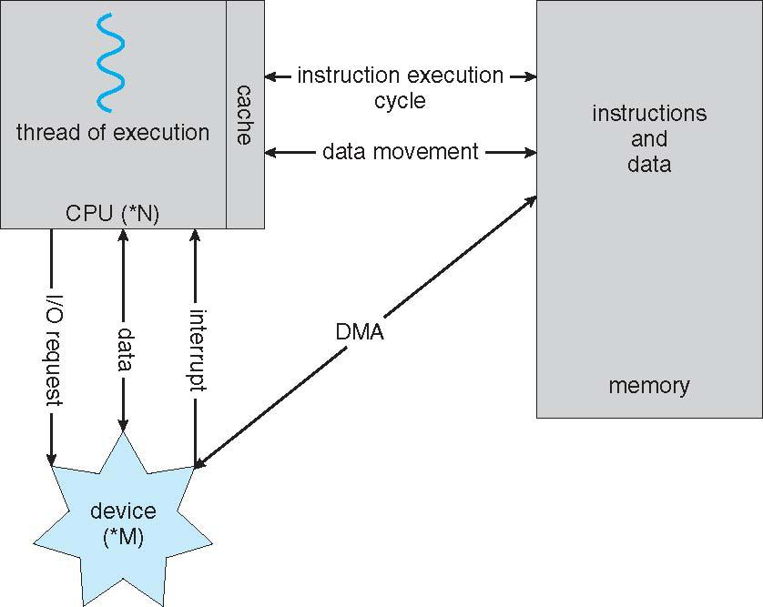
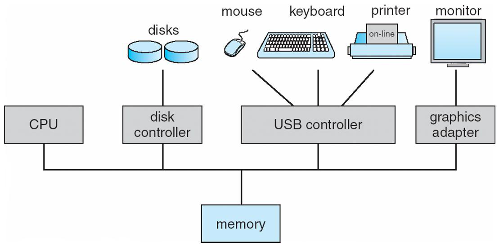
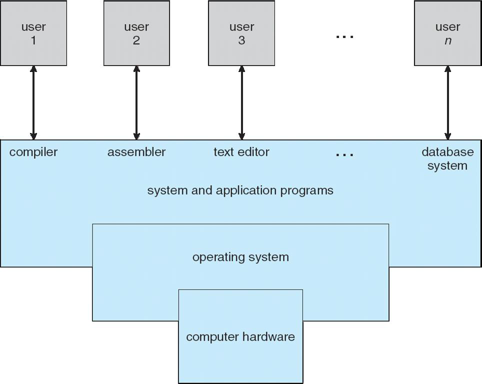

# Operating Systems and Networks

!!! info "Presentation Format"
    This content was originally created as a Marp presentation.

# Operating Systems and Networks

Video: [https://youtu.be/20nYpzybp14](https://youtu.be/20nYpzybp14)

## Sources

### Operating systems

* Silbershatz’s operating system (OS) book and modified/ reordered
* as needed and added some of my own slides/ figures

### Networking 

* Taken from slides available online for Kurose -Ross’
* textbook on Computer Networking: A Top -Down Approach ,
* sixth edition, and adapted to suite our discussion

## Overview of Operating Systems

## How a Modern Computer Works

* How a Modern Computer Works

## Traditional Computing Resources

* How to manage all these resources?
* How to share these with the applications that need them?

## What is an Operating System

* A program that acts as an intermediary between a user of a computer and the computer hardware
* Operating system goals
    * Execute user programs and make solving user problems easier
    * Make the computer system convenient to use
    * Use the computer hardware in an efficient manner

## Operating System Definition

* OS is a resource allocator.
    * Manages all resources
    * Decides between conflicting requests for efficient and fair resource use
* OS is a control program.
    * Controls execution of programs to prevent errors and improper  use of the computer

## Common Functions of Interrupts

- Interrupt transfers control to the interrupt service routine generally,
through the interrupt vector, which contains the addresses of all
the service routines.
- Interrupt architecture must save the address of the interrupted instruction.
- Incoming interrupts are disabled while another interrupt is being processed to prevent a lost interrupt.
- A trap is a software -generated interrupt caused either by an error or a user request.
- An operating system is interrupt driven.

