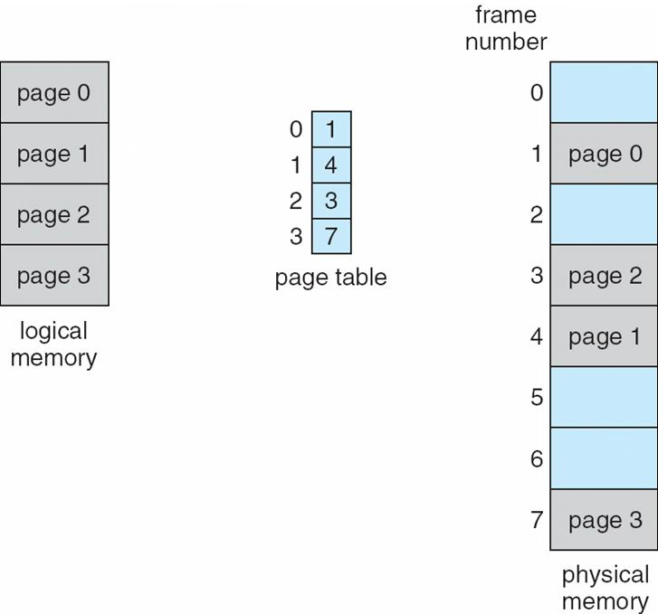
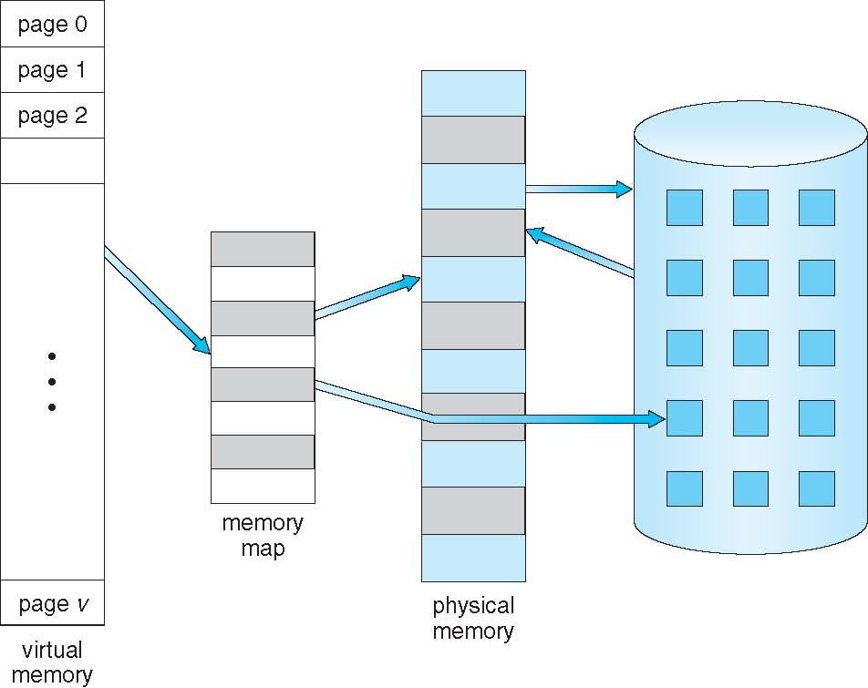
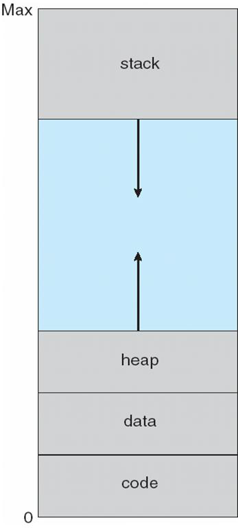
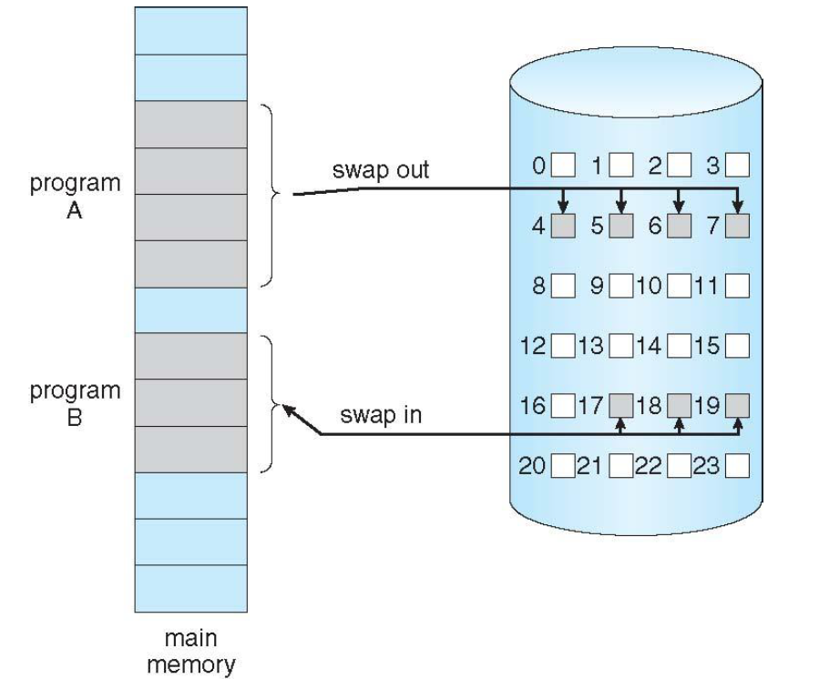

# Memory Management

!!! info "Presentation Format"
    This content was originally created as a Marp presentation.

# Memory Management

Video: [https://youtu.be/geFoSPvQ9jQ](https://youtu.be/geFoSPvQ9jQ)

## Memory Management
- All data in memory before and after processing
- All instructions in memory in order to execute
- Memory management determines what is in memory when:
- Optimizing CPU utilization and computer response to users
- Memory management activities
    - Keeping track of which parts of memory are currently being used and by whom
    - Deciding which processes (or parts thereof) and data to move into and out of memory
    - Allocating and deallocating memory space as needed

## Logical and Physical Memory
- Physical memory 
  - Physical storage device
  - Divided into fixed size blocks called frames (size is power of 2, between 512 bytes and 8192 bytes)
- Logical Memory
    - Divided into fixed size blocks called pages
    - Divided into two parts:
        - User memory: contains user programs and data
        - Kernel memory: contains kernel programs and data
    - User memory is divided into two parts:
        - Text: contains the instructions for the user programs

## Memory-Management Unit (MMU)
- Hardware device that translates logical addresses to physical addresses
- 3 types of MMU:
    - Segmented MMU
    - Paged MMU
    - TLB MMU
- User Program deals with logical addresses
    - MMU translates logical addresses to physical addresses
    - MMU translates physical addresses to frames
    - MMU translates frames to pages
    - MMU translates pages to user memory

## Paging
- Logical address space of a process can be noncontinuous; process is allocated physical memory whenever it is available.
- Divides physical address space into frames (fixed size between 512 and 8192 bytes)
- Divides logical address space into pages
- Keep track of all free frames
- To run a progam of size n pages, need to find n free frames  and load the program
- Set up a page table to translate logical to physical addresses
- Internal Fragmentation

## Paging Model of Logical and Physical Memory

## Shared Pages
### Shared code
- One copy of read -only (reentrant) code shared among processes (i.e., text editors, compilers, window systems)
- Shared code must appear in same location in the logical address space of all processes

### Private code and data

- Each process keeps a separate copy of the code and data
- The pages for the private code and data can appear anywhere in the logical address space
-

## Virtual Memory

- Virtual memory: separation of user logical memory from physical memory
    - Only part of the program needs to be in memory for execution
    - Logical address space can therefore be much larger than physical
    - address space
    - Allows address spaces to be shared by several processes
    - Allows for more efficient process creation
- Virtual memory can be implemented via:
    - Demand paging
    - Demand segmentation Virtual Memory

## Larger Than Physical Memory

## Virtual-Address Space

- Stack
- Virtual -Address Space
- Heap
- Data
- Code

## Demand Paging
- Bring a page into memory only when it is needed
    - Less I/O needed
    - Less memory needed
    - Faster response
    - More users
- Page is needed —reference to it
    - Invalid reference — abort
    - Not in memory — bring to memory
- Lazy swapper: never swaps a page into memory unless page will be needed
    - Swapper that deals with pages is a pager Demand Paging

## Transfer of a Paged Memory
- Transfer of a Paged Memory

## Page fault
- If there is a reference to a page, first reference to that page will trap to operating system
  - Page Fault

1. Operating system looks at another table to decide
    - Invalid reference: abort
    - Just not in memory
2. Get empty frame
3. Swap page into frame
4. Reset tables
5. Set validation bit = v
6. Restart the instruction that caused the page fault

## Copy-on-Write
- Copy -on-write (COW) allows both parent and child processes to initially share the same pages in memory.
- If either process modifies a shared page, only then is the page copied.
- COW allows more efficient process creation as only modified pages are copied.
- Free pages are allocated from a pool of zeroed out pages. 
-

### What happens if There is No Free Frame?
- Page replacement: find some page in memory, but not really in use, swap it out
    - Algorithm
    - Performance: want an algorithm which will result in minimum
- Same page may be brought into memory several times

## Page Replacement

- Prevent over -allocation of memory by modifying page fault service routine to include page replacement
- Use modify (dirty) bit to reduce overhead of page transfers: only modified pages are written to disk
- Page replacement completes separation between logical memory and physical memory: large virtual memory can be provided on a smaller physical memory

