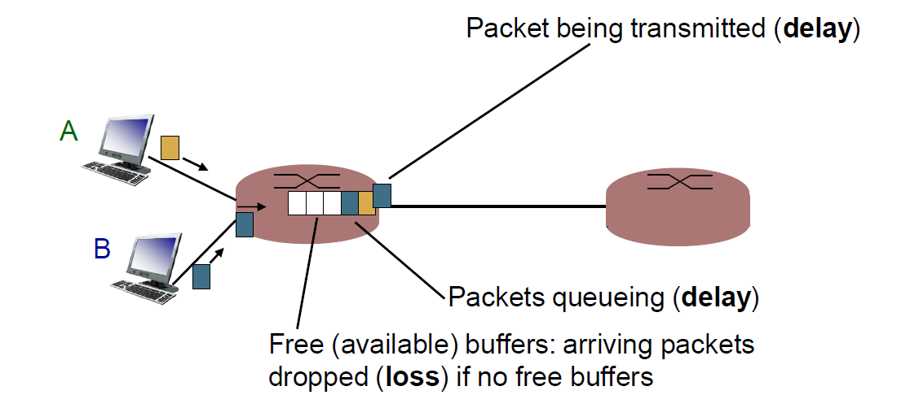

# Important Considerations

!!! info "Presentation Format"
    This content was originally created as a Marp presentation.

# Important Considerations

Video: [https://youtu.be/Ry1WohzU2E4](https://youtu.be/Ry1WohzU2E4)

## Reasons for Losses and Delays
- Packets queue in router buffers
- Packet arrival rate to link (temporarily) exceeds output link capacity
- Packets queue, wait for turn
    

## Reasons for Losses and Delays

dnodal = dproc + dqueue + dtrans + dprop

- dproc: nodal processing
    - Check bit errors
    - Determine output link
    - Typically less than a msec 
- dqueue: queueing delay
    - Time waiting at output link for
    - transmission
    - Depends on congestion level

## Relation to Cloud

- Cloud -hosted services are deployed in data centers, which are often many network hops away from the clients.
- The sources of losses and delays are very likely to occur when accessing the cloud -hosted services.
- These issues thus become one of the determinants of performance of cloud -hosted services experienced by the client.

