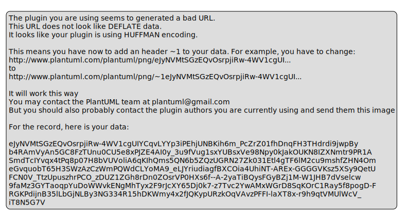

# Architecture Diagrams

This page contains all the PlantUML diagrams used throughout the course.

## 01 Scheduling Flow

*Source: 01_scheduling_flow.puml*

---

## 02 Filtering Predicates

*Source: 02_filtering_predicates.puml*

---

## 03 Scoring Selection

*Source: 03_scoring_selection.puml*

---

## 04 Affinity Taints Spread

*Source: 04_affinity_taints_spread.puml*

---

## 05 Priority Preemption

*Source: 05_priority_preemption.puml*

---

## 06 Debugging Scheduling

*Source: 06_debugging_scheduling.puml*

---

## Basiccontainernetworkingdiagram

*Source: BasicContainerNetworkingDiagram.puml*

---

## Cnipluginworkflowdiagram

*Source: CNIPluginWorkflowDiagram.puml*

---

## Draining

*Source: Draining.puml*

---

## Externalinternal

*Source: ExternalInternal.puml*

---

## Globalregional

*Source: GlobalRegional.puml*

---

## Healthcheck

*Source: HealthCheck.puml*

---

## Kubernetesarchitecturediagram

*Source: KubernetesArchitectureDiagram.puml*

---

## Kubernetescontrolplaneworkflow

*Source: KubernetesControlPlaneWorkflow.puml*

---

## Kubernetesdeploymentcomponentsdiagram

*Source: KubernetesDeploymentComponentsDiagram.puml*

---

## Kubernetesservicetypesdiagram

*Source: KubernetesServiceTypesDiagram.puml*

---

## L4L7

*Source: L4L7.puml*

---

## Macvlan Ipvlan Networking Diagram

*Source: MacVLAN_IPVLAN_Networking_Diagram.puml*

---

## Overlaynetworkdiagram

*Source: OverlayNetworkDiagram.puml*

---

## Scheduling

*Source: Scheduling.puml*

---

## Servicemesharchitecture

*Source: ServiceMeshArchitecture.puml*

---

## Tls

*Source: TLS.puml*

---

## Workernodeworkflowsequence

*Source: WorkerNodeWorkflowSequence.puml*

---

## Architecture

*Source: architecture.puml*

---

## Assignments

*Source: assignments.puml*

---

## B G P Route Based Container Networking Diagram

*Source: b_g_p_route_based_container_networking_diagram.puml*

---

## Bridge

*Source: bridge.puml*

---

## C N I Plugin Workflow Diagram

*Source: c_n_i_plugin_workflow_diagram.puml*

---

## Highlevelrest

*Source: highlevelREST.puml*

---

## Host Networking Mode Diagram

*Source: host_networking_mode_diagram.puml*

---

## Messagebroker

*Source: messagebroker.puml*

---

## Openstack

*Source: openstack.puml*

---

## Overlay Network V X L A N

*Source: overlay_network_v_x_l_a_n.puml*

---

## Point-Tp-Point

*Source: point-tp-point.puml*

---

## Pubsub

*Source: pubsub.puml*

---

## Request Reply Messaging Pattern

*Source: request_reply_messaging_pattern.puml*

---

## Sdi

*Source: sdi.puml*

---

## Service Mesh With Sidecar Proxies

*Source: service_mesh_with_sidecar_proxies.puml*

---

## Topic Based Messaging Pattern

*Source: topic_based_messaging_pattern.puml*

---

