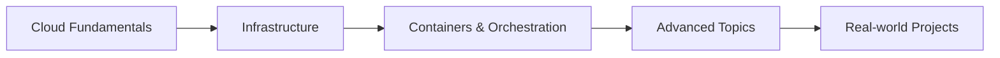

# CS 5287 - Cloud Computing

    <h2>Vanderbilt University - School of Engineering</h2>
    
<strong>Instructor:</strong> Dr. Darren Pulsipher

    
<strong>Semester:</strong> Fall 2025

## Welcome

Welcome to the CS 5287 Cloud Computing course materials site. This course provides an in-depth understanding of **cloud computing concepts, architectures, and technologies** through hands-on learning and real-world applications.

## Quick Navigation

    

        <h3>📚 Course Information</h3>
        <ul class="week-topics">
            <li><a href="syllabus/">Course Syllabus</a></li>
            <li><a href="schedule/">Assignment Schedule</a></li>
        </ul>
    

    
    

        <h3>📝 Assignments</h3>
        <ul class="week-topics">
            <li><a href="assignments/">Assignment Overview</a></li>
            <li><a href="assignments/ca0/">CA0 - Manual Deployment</a></li>
            <li><a href="assignments/ca1/">CA1 - Infrastructure as Code</a></li>
            <li><a href="assignments/ca2/">CA2 - PaaS Orchestration</a></li>
            <li><a href="assignments/ca3/">CA3 - Cloud-Native Ops</a></li>
            <li><a href="assignments/ca4/">CA4 - Multi-Hybrid Cloud</a></li>
        </ul>
    

    
    

        <h3>🎓 Weekly Content</h3>
        <ul class="week-topics">
            <li><a href="weeks/week-01/">Week 1 - Cloud Fundamentals</a></li>
            <li><a href="weeks/week-02/">Week 2 - Systems & Networking</a></li>
            <li><a href="weeks/week-03/">Week 3 - Virtualization & IaC</a></li>
            <li><a href="weeks/week-04/">Week 4 - Containers</a></li>
            <li><a href="weeks/week-05/">Week 5 - Kubernetes</a></li>
            <li>... and more</li>
        </ul>
    

## Course Overview

This course walks you through cloud computing from fundamentals to advanced topics:

!!! info "Course Structure"
    - **Before Class:** Watch videos, read materials, work on assignments
    - **During Class:** Discussions, breakout sessions, presentations
    - **After Class:** Complete assignments, prepare for next week

### Learning Path

## Recent Updates

- ✅ Course site launched with all materials
- ✅ Week 1-4 content available
- 🔄 Assignment CA0 released
- 📅 See [schedule](schedule/) for upcoming deadlines

## Getting Help

- **Office Hours:** By appointment
- **Email:** [darren.pulsipher@vanderbilt.edu](mailto:darren.pulsipher@vanderbilt.edu)
- **Course Repository:** [GitHub](https://github.com/your-username/CS5287-Cloud)

!!! tip "Using Generative AI"
    This course **requires** the use of GenAI tools for learning, creating, and presenting. 
    Always verify AI-generated content and disclose your AI usage in assignments.

---

*Last updated: $(date)*
